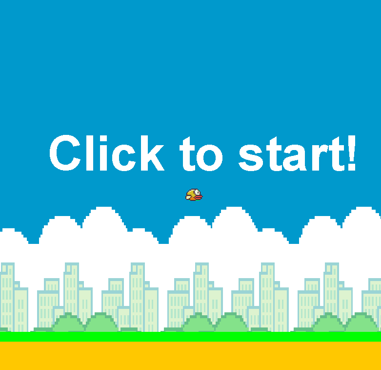

# Flappy Bird 

## Description
This is a short and simple game made with Java Swing. The game is a clone of the popular game Flappy Bird. The game is a side-scrolling game where the player controls a bird, attempting to fly between columns of green pipes without hitting them. The player scores points by successfully passing between the pipes. The game ends if the bird hits a pipe or the ground. The game gets faster the more points you earn.
The bird gets faster the more points you earn.

## Features
- The game has a start screen where the player can start the game by pressing the spacebar
- The game has a game over screen 
- The game has a score counter that increases by one every time the bird passes a pipe
- The game has working collision detection

## How to play
- Press the spacebar to start the game
- Press the spacebar to make the bird jump
